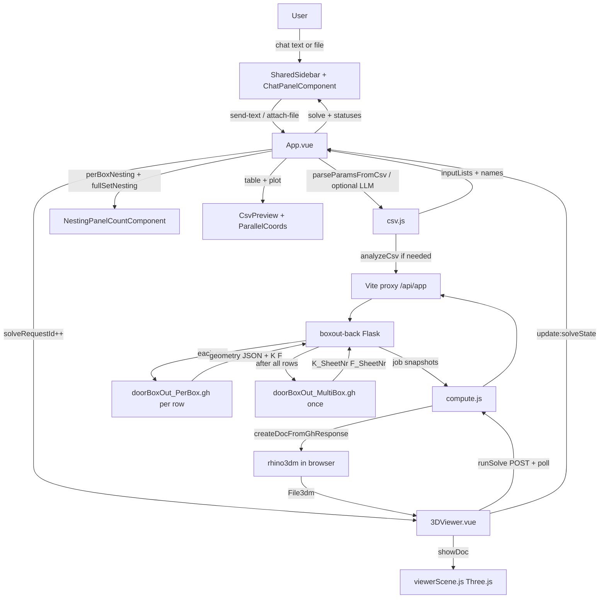
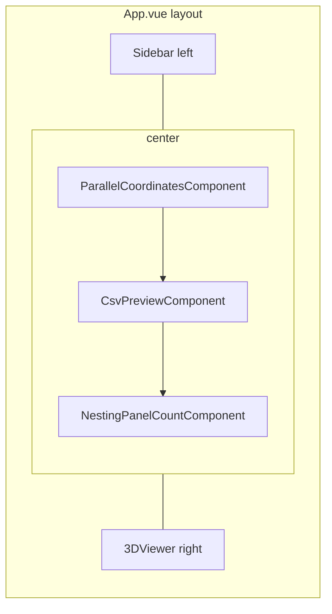
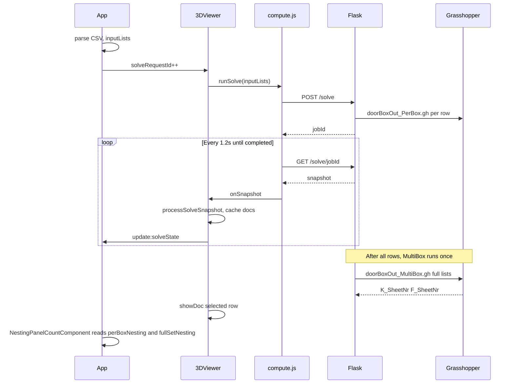

# DoorBoxOut MVP — Beginner’s guide

This project is a small web app for **DoorBoxOut**: you describe box sizes in a **chat panel** (natural language or CSV/Excel attach/drag-drop), the app sends them to **Grasshopper** definitions via a Python backend, and you see a **table**, a **parallel-coordinates chart**, a **3D preview** for each row, and **nesting panel counts** (per-box sum and full-set batch).

The repo has two main parts:

| Folder | Role |
|--------|------|
| [`boxout-front/`](boxout-front/) | Vue 3 + Vite website (what you see in the browser) |
| [`boxout-back/`](boxout-back/) | Flask API that talks to Rhino Compute / Grasshopper |

You can start both with [`run.bat`](run.bat) (Windows): backend on port **5000**, frontend on Vite’s dev port (usually **5173**).

---

## How to run (quick start)

1. Install dependencies for backend (Python + Pipenv) and frontend (`npm install` in `boxout-front`).
2. Configure backend env (see `boxout-back` docs / `.env`) so Compute can reach your Grasshopper definition.
3. Double-click **`run.bat`** or run backend and frontend in two terminals.
4. Open the Vite URL in the browser. Use the **chat panel** (left sidebar):
   - Type a box as **Width × Height × Depth** (e.g. `900 × 2100 × 300`)
   - Or attach/drag a CSV/Excel file like [`test_files/DoorBoxOut_Params_Variations_OK.csv`](test_files/DoorBoxOut_Params_Variations_OK.csv)

Expected CSV shape:

- First column: box name (e.g. `Box 1`)
- Columns: `BoxDepth`, `BoxHeight`, `BoxWidth` (whole integers within allowed ranges; decimals or messy headers may be sent to **Claude** for normalization)

**Chat commands** (via `POST /api/app/chat/command`):

- **Add** — `"900 × 2100 × 300"` or `"add another box …"`
- **Update** — `"in box 2, width should be 950"`
- **Delete** — `"delete box 2"`
- **Clear** — `"clear all"` or the **Clear all** button

If you attach a CSV while boxes already exist, the chat asks **append** or **overwrite**.

---

## Big-picture flow diagram

This is the path from “user picks a file” to “3D geometry and nesting counts on screen”:



### Step-by-step (what happens on CSV upload)

1. **Sidebar** fires an `upload` event with the file.
2. **App** reads the file text and calls **`tryParseCleanCsv`** in `csv.js`:
   - **Local path** — strict parse succeeds, all dimensions are whole integers → **`parseParamsFromCsv`** only (out-of-range cells are still shown; the table flags them).
   - **LLM path** — parse fails, or any dimension has decimals → `POST /api/app/csv/analyze` (Claude); names stay from column 1 of the CSV, numbers from the LLM when present (rounded to integers).
3. App stores:
   - `inputLists` — three arrays (`BoxDepth`, `BoxHeight`, `BoxWidth`), one value per row
   - `variationNames` — names from the first column
   - `csvSourceLists` — copy of original numbers (to highlight edits later)
   - `csvParseSource` — `'local'` or `'llm'` (shown in Sidebar)
4. App increments **`solveRequestId`**. That number is the “please run compute now” signal.
5. **3DViewer** watches `solveRequestId`. When it changes, it calls **`runSolve`** in `compute.js`.
6. **`runSolve`**:
   - Loads rhino3dm WASM once (`loadRhino`)
   - `POST /api/app/solve` with `{ inputLists }` → backend starts a **single job**
   - Every ~1.2s: `GET /api/app/solve/:jobId` until status is `completed` or `failed`
   - On each poll, **`processSolveSnapshot`**:
     - merges new **geometry** into a cache (Map: row index → 3dm doc)
     - reads **`perBoxNesting`** (`kSheetNr`, `fSheetNr` — running sum as each row finishes)
     - reads **`fullSetNesting`** when the backend has finished the multibox step (`kSheetNr`, `fSheetNr`)
7. On the backend, that one job runs **three routines** (same poll loop):
   - **Per row:** `doorBoxOut_PerBox.gh` — geometry for the 3D viewer plus `K_SheetNr` and `F_SheetNr` for that row (summed on the server)
   - **Once at the end:** `doorBoxOut_Multibox.gh` — full CSV lists → full-set `K_SheetNr` and `F_SheetNr`
8. **3DViewer** emits **`update:solveState`** so App can update Sidebar, the table, and the nesting panel (progress, row status, errors, nesting counts).
9. For the **selected row**, **3DViewer** passes the cached doc to **`viewerScene.js`**, which builds Three.js meshes.
10. **NestingPanelCountComponent** (below the CSV table) shows two columns from `solveState`:
    - **Per Box Nesting** (left) ← `perBoxNesting` — sum of each row’s K/F as rows complete
    - **Full Set Nesting** (right) ← `fullSetNesting` — multibox result after all rows
    - Each column: Kiefer Plate Panel Count and Film Plate Panel Count
    - `—` before values exist, `Computing…` while solving and that column is still null

There are **no Web Workers** — networking, WASM, and WebGL all run on the browser’s main thread. Nesting counts use the **same poll loop** as geometry; there is no separate job or endpoint.

---

## UI layout (what you see)



| Area | Component | Purpose |
|------|-----------|---------|
| Left | `@dashboard/shared` `Sidebar` + local `ChatPanelComponent` | Chat input (text, attach, drag-drop), append/overwrite confirm, Clear all |
| Center top | `ParallelCoordinatesComponent.vue` | D3 chart: one line per variation, three axes |
| Center middle | `CsvPreviewComponent.vue` + `CsvVariationRow.vue` | Table of parameters; click row to select |
| Center bottom | `NestingPanelCountComponent.vue` | Per Box + Full Set nesting counts (Kiefer / Film each) |
| Right | `3DViewer.vue` | Runs solve job + shows 3D model for selected row |

**Selection is shared**: `selectedVariationIndex` in App is bound to the plot, table, and viewer so they stay in sync. The nesting panel is **job-level** (not tied to the selected row): per-box totals sum all rows; full-set is one multibox result for the whole CSV.

---

## Frontend file guide

All frontend code lives under [`boxout-front/src/`](boxout-front/src/).

### Entry

| File | What it does |
|------|----------------|
| [`main.js`](boxout-front/src/main.js) | Creates the Vue app and mounts `App.vue` on `#app`. |
| [`styles/styles.css`](boxout-front/src/styles/styles.css) | Global CSS variables and base styles. |
| [`vite.config.js`](boxout-front/vite.config.js) | Dev server; proxies `VITE_API_BASE` → `VITE_BACKEND_URL` from [`boxout-front/.env`](boxout-front/.env). |
| [`src/scripts/env.js`](boxout-front/src/scripts/env.js) | Reads `VITE_API_BASE` and `VITE_POLL_INTERVAL_MS` for the browser. |

### Root component — [`App.vue`](boxout-front/src/App.vue)

**Role:** “Conductor” — holds shared data and wires components together. It does **not** call the solve API itself; that lives in `3DViewer.vue`.

Important state (Vue `ref`s):

| State | Meaning |
|-------|---------|
| `inputLists` | Current GH inputs: `{ BoxDepth: [], BoxHeight: [], BoxWidth: [] }` |
| `csvSourceLists` | Snapshot from first upload (for “edited cell” highlighting) |
| `variationNames` | Name per row |
| `selectedVariationIndex` | Which row is active (0, 1, 2, …) |
| `solveRequestId` | Counter; +1 after add/update/delete or file import → triggers solve in 3DViewer |
| `chatMessages` | Chat bubble history |
| `pendingFileImport` | Parsed CSV waiting for append/overwrite choice |
| `csvParseSource` | `'local'` \| `'llm'` \| `null` — how the last file was parsed |
| `solveState` | Progress from viewer: per-row status, errors, nesting counts |

Important functions:

- **`processChatText`** — LLM command (add/update/delete/clear) or file-import reply (`append` / `overwrite` / `cancel`)
- **`processChatFile`** — parse CSV/Excel; confirm append/overwrite if rows exist
- **`applyVariationPayload`** — merge rows with mode `replace` \| `append` \| `overwrite`
- **`onSolveStateUpdate`** — sync viewer state into `solveState`

---

### Scripts (plain JavaScript modules)

#### [`scripts/csv.js`](boxout-front/src/scripts/csv.js)

**Role:** Everything about the CSV file — no network, no 3D.

- Constants: parameter names, min/max bounds, column labels, parse-source labels
- **`tryParseCleanCsv(text)`** — local parse when possible; sets `needsAi` for decimals or unparseable structure
- **`parseParamsFromCsv(text)`** — strict parse: headers, names, numbers
- **`parseLenientLocalCsv`** / **`mergeAnalyzeWithLocalParse`** — LLM path: keep names from column 1, merge normalized numbers from Claude
- **`validateInputLists`** — before Recalculate, checks lengths and numeric ranges
- **`formatVariationCellDisplay`** — table labels (`missing value`, `value out of valid range`)
- **`inputListsToVariationRows`** — shapes data for the table
- **`getEditedCellKeys`** — compares current vs `csvSourceLists` for yellow highlight

#### [`scripts/compute.js`](boxout-front/src/scripts/compute.js)

**Role:** The **only** frontend module that talks to the backend and decodes GH geometry.

| Function | Purpose |
|----------|---------|
| `getDefinitionDefaultParams()` | `GET /api/app/definition-defaults` |
| `analyzeCsv(csvText)` | `POST /api/app/csv/analyze` → Claude normalizes messy/decimal CSV (file LLM path) |
| `parseBoxCommand(message, existingBoxes)` | `POST /api/app/chat/command` → add / update / delete / clear |
| `startSolveJob(inputLists)` | `POST /api/app/solve` → returns `jobId` |
| `getSolveJob(jobId)` | `GET /api/app/solve/:jobId` → progress + partial results |
| `runSolve(inputLists, { onSnapshot })` | Starts job, polls until done, calls `onSnapshot` each time |
| `processSolveSnapshot(snapshot, acc)` | Merges one poll into cache, errors, warnings, progress, `perBoxNesting`, `fullSetNesting` |
| `loadRhino()` | Loads rhino3dm WASM once |
| `createDocFromGhResponse(payload)` | Turns GH JSON into a `File3dm` for display |

#### [`scripts/solveState.js`](boxout-front/src/scripts/solveState.js)

**Role:** Shared vocabulary and helpers for solve UI (no API).

- `SOLVE_STAGE` — `idle`, `running`, `completed`, `failed`
- `ROW_STATUS` — `pending`, `computing`, `done`, `failed` (per table row)
- **`createSolveState()`** — default object shape for progress UI (includes `perBoxNesting` and `fullSetNesting`, each `{ kSheetNr, fSheetNr }`)
- **`buildVariationStatuses(...)`** — builds the status array for each row from cache + errors + progress

#### [`scripts/viewerScene.js`](boxout-front/src/scripts/viewerScene.js)

**Role:** Three.js only — scene, camera, meshes, resize.

- **`createViewerScene(containerEl)`** returns `{ showDoc, clearSceneMeshes, resize, dispose }`
- Converts Rhino meshes to Three.js, draws edges, fits orthographic camera to model
- Rhino uses Z-up; the scene rotates the model for Three.js Y-up

---

### Vue components

#### Shared shell — `@dashboard/shared` `Sidebar` + local [`ChatPanelComponent.vue`](src/components/ChatPanelComponent.vue)

- `ChatPanelComponent` wraps shared `ChatPanel` with boxout file types and copy
- Chat message list, text composer, **Attach**, **Send**, **Clear all**
- Drag-and-drop CSV/Excel on the panel
- Confirm buttons for **append** / **overwrite** / **cancel** when importing over existing boxes

#### [`components/ParallelCoordinatesComponent.vue`](boxout-front/src/components/ParallelCoordinatesComponent.vue)

- Uses **D3** to draw one polyline per variation across three vertical axes (BoxDepth, BoxHeight, BoxWidth)
- Click a line to select that row (`v-model:selected-index`)
- ResizeObserver redraws when the panel size changes

#### [`components/CsvPreviewComponent.vue`](boxout-front/src/components/CsvPreviewComponent.vue)

- Renders the parameter **table**
- In edit mode: number inputs + Recalculate (emits `applyLists` to App)
- Shows row status icons from `solve.variationStatuses` (spinner / check / error)

#### [`components/CsvVariationRow.vue`](boxout-front/src/components/CsvVariationRow.vue)

- One `<tr>`: status cell, name, three parameter cells
- Emits `select` and `update:cell` when editing

#### [`components/NestingPanelCountComponent.vue`](boxout-front/src/components/NestingPanelCountComponent.vue)

- Renders below the CSV table in the center column (two columns side by side)
- **Per Box Nesting** (left): summed K/F from `doorBoxOut_PerBox.gh` per row
- **Full Set Nesting** (right): K/F from `doorBoxOut_MultiBox.gh` once per job
- Props: `perBoxNesting`, `fullSetNesting` (from `solveState`), `solving`
- Job-level counts — same values regardless of which table row is selected

#### [`components/3DViewer.vue`](boxout-front/src/components/3DViewer.vue)

**Role:** Compute orchestration + 3D view.

- Watches **`solveRequestId`** → runs **`startVariationSolve`**
- Keeps **`joinedGeometryCache`** (Map: row index → Rhino doc) locally
- Emits **`update:solveState`** after each poll so App/Sidebar/table/nesting panel update
- Overlays: “Computing geometry…” or per-row error message
- Delegates drawing to **`viewerScene.js`**

---

## Backend (brief) — [`boxout-back/`](boxout-back/)

The frontend never calls Rhino Compute directly. Flask exposes:

| HTTP route | Meaning |
|------------|---------|
| `GET /health` | Sanity check |
| `GET /definition-defaults` | Params that come from the `.gh` file defaults |
| `POST /csv/analyze` | Body: `{ "csvText": "..." }` → Claude normalizes file CSV (when local parse needs help) |
| `POST /chat/command` | Body: `{ "message", "existingBoxes": [...] }` → `{ "action": "add"\|"update"\|"delete"\|"clear", ... }` |
| `POST /solve` | Body: `{ "inputLists": { "BoxDepth": [...], ... } }` → starts job, returns `jobId` |
| `GET /solve/<job_id>` | Job status, which rows finished, geometry payloads, `perBoxNesting`, `fullSetNesting` |

Vite rewrites browser calls:

- Browser: `fetch('/api/app/solve', …)`
- Proxy: `http://localhost:5000/solve`

Implementation detail (inside `compute_service`) is outside the frontend; the UI only depends on the JSON shape above.

---

## Data flow diagram (solve job)



---

## Key ideas for beginners

### Vue 3 basics used here

- **`ref(...)`** — reactive variables; update with `.value` in script
- **`computed`** — derived values (e.g. which doc to show)
- **`watch`** — run code when something changes (e.g. `solveRequestId`)
- **Props down, events up** — parent passes data; child `emit`s actions
- **`defineModel`** — used for selected row index between App and children

### Why `solveRequestId` instead of watching `inputLists`?

Editing a cell changes numbers **inside** the same object. Vue might not treat that as a “new” object. Bumping a counter is an explicit “run compute again” signal (same idea as the reference `ref files/App.vue` pattern).

### Why separate `compute.js` and `3DViewer`?

- **`compute.js`** — all API + rhino3dm decoding (easy to find “where is fetch?”)
- **`3DViewer.vue`** — when to solve, caching per row, UI overlays
- **`viewerScene.js`** — Three.js details isolated from Vue

### Per-row status logic

For each row index `i`:

1. If geometry is in the cache → **done**
2. Else if `rowErrors` has `i` → **failed**
3. Else if backend is computing row `i` now → **computing**
4. Else → **pending**

---

## Project map (folders)

```
MVP/
├── readme.md                 ← this file
├── run.bat                   ← start backend + frontend
├── test_files/               ← sample CSVs
├── boxout-front/             ← Vue app
│   ├── src/
│   │   ├── App.vue
│   │   ├── main.js
│   │   ├── components/
│   │   └── scripts/
│   └── vite.config.js
├── boxout-back/              ← Flask API
│   └── app.py
└── ref files/                ← old reference examples (not used at runtime)
```

---

## Troubleshooting

| Symptom | Things to check |
|---------|------------------|
| No compute / empty viewer | Backend running on 5000? Browser Network tab for `/api/app/solve` |
| CSV error | Columns named BoxDepth, BoxHeight, BoxWidth; first column has names |
| LLM / analyze error | `ANTHROPIC_API_KEY` set in `boxout-back/.env`; backend restarted after prompt edits |
| Stuck on “Computing…” | Backend job failed — see Sidebar error or `solveState.solveError` |
| 3D blank but row “done” | Geometry might not be meshes; viewer only displays `rhino.Mesh` |

---

## Further reading

- [Vue 3 guide](https://vuejs.org/guide/introduction.html) — components, reactivity
- [Vite](https://vite.dev/) — dev server and proxy
- [Three.js](https://threejs.org/docs/) — 3D viewer in `viewerScene.js`
- [rhino3dm](https://github.com/mcneel/rhino3dm) — WASM library for reading GH output in the browser
