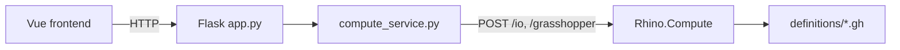
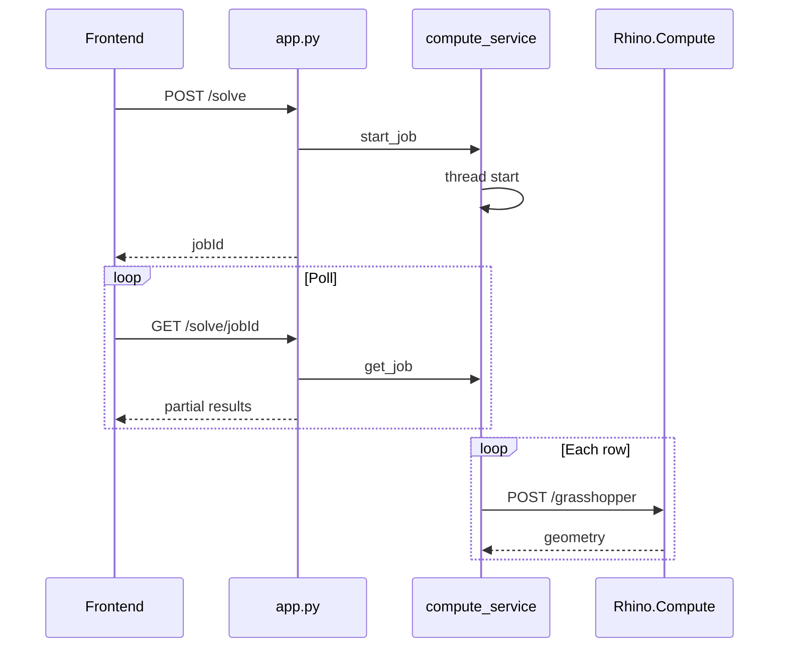

# Boxout backend

A small **Flask** API between the Vue frontend and **Rhino.Compute** (Grasshopper). It does not render 3D itself: it validates CSV numbers, runs `.gh` definitions row by row, and returns geometry JSON the browser decodes with rhino3dm.

**Source files are commented** — open them in this order if you are learning the codebase.

---

## What this service does (one sentence)

The browser sends box dimensions from chat or CSV; the backend runs Grasshopper for each row and lets the browser **poll a ticket** until every row finishes or fails. **`POST /csv/analyze`** normalizes messy file CSV; **`POST /chat/command`** interprets chat messages (add, update, delete, clear) via Claude.

---

## Big picture



| Piece | Role |
|-------|------|
| **Frontend** | CSV upload, table, 3D viewer; polls every ~1.2s |
| **`app.py`** | Routes and JSON only |
| **`compute_service.py`** | Tickets + Rhino.Compute calls |
| **`config.py`** | `.env` + which `.gh` files exist (`DEFINITIONS`) |
| **`llm.py`** | Claude: `CSVAnalyzer` (file CSV), `BoxCommandParser` (chat commands) |
| **Rhino.Compute** | Runs Grasshopper (default `http://127.0.0.1:6500`) |

---

## Reading the code (beginner path)

| Order | File | What you learn |
|-------|------|----------------|
| 1 | `config.py` | `.env` variables and `DEFINITIONS` — **start here to add a .gh** |
| 2 | `app.py` | Which URLs exist and what they return |
| 3 | `api_helpers.py` | How POST body and poll JSON are shaped; `normalize_csv_analyze_result` |
| 4 | `compute_service.py` | Tickets, background thread, Compute HTTP |
| 5 | `llm.py` | Claude: `/csv/analyze` (files), `/chat/command` (chat) |

**Rule:** `app.py` never calls Rhino.Compute. `compute_service.py` never defines Flask routes.

---

## Project layout

| File / folder | Purpose |
|---------------|---------|
| `config.py` | Settings from `.env` + `DEFINITIONS` registry |
| `app.py` | HTTP API (`/definitions/...` + legacy `/solve`) |
| `api_helpers.py` | Parse `inputLists`, format poll responses, pad LLM analyze output |
| `compute_service.py` | Jobs/tickets, threading, Grasshopper solves |
| `llm.py` | `CSVAnalyzer`, `BoxCommandParser` — Anthropic API |
| `prompts/base-prompt.md` | Claude instructions for CSV file normalization |
| `prompts/box-command-prompt.md` | Claude instructions for chat add/update/delete/clear |
| `assets/schema.json` | CSV analyze JSON shape |
| `assets/chat-command-schema.json` | Chat command JSON shape |
| `definitions/` | `.gh` files — see `definitions/README.md` |
| `.env` | Local overrides (gitignored; copy `.env.example`) |
| `Pipfile` | Dependencies; `pipenv run dev` → `python app.py` |

---

## Running locally

1. Install [Pipenv](https://pipenv.pypa.io/) and Python 3.14 (`Pipfile`).
2. `cd boxout-back` → `pipenv install`
3. Start **Rhino.Compute** at the URL in `.env` (default `http://127.0.0.1:6500`).
4. Start Flask:

   ```bash
   pipenv run dev
   ```

   Or: `pipenv run python app.py` (port **5000** by default).

5. Start the frontend; Vite proxies `/api/app/*` → this server.

From repo root, `run.bat` can start both.

---

## Configuration

### `.env`

Copy `.env.example` → `.env`. Loaded once in `config.py`.

| Variable | Default | Meaning |
|----------|---------|---------|
| `PORT` | `5000` | Flask port |
| `FLASK_DEBUG` | `1` | Auto-reload / tracebacks when using `python app.py` |
| `FLASK_HOST` | `127.0.0.1` | Bind address |
| `COMPUTE_BASE_URL` | `http://127.0.0.1:6500` | Rhino.Compute |
| `COMPUTE_API_KEY` | (empty) | `RhinoComputeKey` header if required |
| `DEFINITIONS_DIR` | `definitions` | Folder for `.gh` files |
| `DEFAULT_DEFINITION_ID` | `joint-wiz` | Target for legacy `/solve` routes |
| `COMPUTE_TIMEOUT_SECONDS` | `120` | Max seconds per Compute HTTP call |
| `ANTHROPIC_API_KEY` | (empty) | Required for `POST /csv/analyze` and `POST /chat/command` |

### `config.py` → `DEFINITIONS`

Register each Grasshopper file (URL id → settings):

```python
DEFINITIONS = {
    "joint-wiz": {
        "label": "JointWiz",
        "gh_file": "doorBoxOut_PerBox.gh",
        "stage": "joined",
        "enabled": True,
    },
}
```

- **`enabled: False`** — discovery works; **POST solve returns 501** until you set `True`.
- Restart Flask after edits.

---

## HTTP API

### `GET /definitions`

Lists ids, labels, stages, `enabled`, file found, and route paths.

### Per-definition (`<id>` = e.g. `joint-wiz`)

| Method | Path | Purpose |
|--------|------|---------|
| `GET` | `/definitions/<id>/definition-defaults` | GH defaults (not CSV columns) |
| `POST` | `/definitions/<id>/solve` | Start ticket → `jobId` (202) |
| `GET` | `/definitions/<id>/solve/<jobId>` | Poll progress + geometry |

### Legacy (Vue app today → `DEFAULT_DEFINITION_ID`)

| Method | Path | Same as |
|--------|------|---------|
| `GET` | `/definition-defaults` | `/definitions/joint-wiz/definition-defaults` |
| `POST` | `/csv/analyze` | File CSV normalization (Claude) |
| `POST` | `/chat/command` | Chat add / update / delete / clear (Claude) |
| `POST` | `/solve` | `/definitions/joint-wiz/solve` |
| `GET` | `/solve/<jobId>` | `/definitions/joint-wiz/solve/<jobId>` |

### `GET /health`

Server ok + each definition’s path and whether the `.gh` file exists.

### POST solve body

```json
{
  "inputLists": {
    "BoxDepth": [100, 120],
    "BoxHeight": [200, 200],
    "BoxWidth": [50, 60]
  }
}
```

All three lists must have the **same length** (one index = one CSV row).

### POST `/csv/analyze` body (LLM path)

```json
{
  "csvText": "Param Name,BoxDepth,...\nVariation_0,300,..."
}
```

Response: `{ "inputLists", "variationNames", "variationCount" }`. The frontend **keeps variation names from column 1 of the raw CSV** and merges Claude’s rounded/normalized numbers. Used when local parse fails or when dimensions contain **decimals**. Out-of-range whole integers stay on the local path; the UI flags them without calling Claude.

Implementation: `llm.py` (`CSVAnalyzer`) loads `prompts/base-prompt.md` and `assets/schema.json`, calls `claude-sonnet-4-5`, then `api_helpers.normalize_csv_analyze_result` pads arrays to one row count.

### POST `/chat/command` body (chat LLM)

```json
{
  "message": "in box 2, width should be 950",
  "existingBoxes": [
    { "boxNumber": 1, "name": "Box 1", "BoxWidth": 900, "BoxHeight": 2100, "BoxDepth": 300 },
    { "boxNumber": 2, "name": "Box 2", "BoxWidth": 800, "BoxHeight": 2100, "BoxDepth": 300 }
  ]
}
```

Response examples:

```json
{ "action": "update", "boxNumber": 2, "fields": { "BoxWidth": 950 } }
```

```json
{ "action": "add", "add": { "inputLists": { ... }, "variationNames": ["Box 3"], "variationCount": 1 } }
```

```json
{ "action": "delete", "boxNumber": 2 }
```

```json
{ "action": "clear" }
```

Implementation: `BoxCommandParser` in `llm.py` loads `prompts/box-command-prompt.md` and `assets/chat-command-schema.json`. For `action: add`, the route pads `add.inputLists` via `normalize_csv_analyze_result`.

### Poll response (important fields)

| Field | Meaning |
|-------|---------|
| `status` | `running` \| `completed` \| `failed` |
| `definitionId` | Which `.gh` batch this ticket belongs to |
| `variationCount` | Number of rows |
| `currentVariationIndex` | Row being computed (or `null`) |
| `completedVariations` | Successful row indices |
| `failedVariations` | `{ "2": "error message" }` per row |
| `variationResults` | Geometry per finished row (grows while polling) |
| `error` | Whole-ticket failure message |

---

## Jobs = tickets (how async solve works)

Code says **job** (`jobId`, `start_job`). Think **restaurant ticket**:

1. **Order** — `POST .../solve` with all CSV rows. Response is immediate (202).
2. **Ticket number** — `jobId` (UUID).
3. **Kitchen** — background thread in `compute_service._run_sequential_job` runs row 0, 1, 2…
4. **Check the board** — `GET .../solve/<jobId>` every ~1.2s.
5. **Done** — `status: "completed"`; frontend stops polling.

Not Celery/Redis — just `_jobs` in RAM + one thread per ticket + a lock.

**Limits:** restart Flask → tickets gone. Single process only (no multi-worker without shared storage).



### Inside `start_job` (`compute_service.py`)

1. Validate definition id and `enabled`.
2. Create ticket dict; store in `_jobs`.
3. Start daemon thread → `_run_sequential_job`.
4. Return `jobId`.

### Inside `_run_sequential_job`

For each row index:

1. Set `currentVariationIndex` (progress UI).
2. Slice CSV to one row → `_solve_definition` (one Compute call).
3. Success → `stageResults[stage].byVariation[index]`; failure → `failedVariations` only for that row.
4. End → `status: completed` (or `failed` if the batch aborts).

### Inside `_solve_definition`

1. Read `.gh` bytes.
2. `POST /io` → parameter defaults.
3. Merge CSV columns + GH defaults → `_merge_gh_input_lists`.
4. `POST /grasshopper` → geometry JSON.
5. `_finalize_solve_response` — errors without geometry fail the row; errors with geometry become warnings.

---

## CSV vs Grasshopper defaults

From CSV (see `config.CSV_GH_INPUT_NAMES`):

- `BoxDepth`, `BoxHeight`, `BoxWidth`

Everything else comes from the `.gh` defaults via `/io`.  
`definition-defaults` omits the three CSV names so the UI can show “from file” vs “from Grasshopper.”

---

## Errors (HTTP)

| Situation | Status |
|-----------|--------|
| Bad JSON / `inputLists` | 400 |
| Unknown definition id | 404 |
| Definition not `enabled` | 501 |
| Compute / missing file / GH failure | 500 |
| Wrong or expired `jobId` | 404 |
| One row fails | Row in `failedVariations`; ticket may still `completed` |

---

## Adding a new definition

1. Put `MyStage.gh` in `definitions/`.
2. Add to `DEFINITIONS` in `config.py`:

   ```python
   "my-stage": {
       "label": "My Stage",
       "gh_file": "MyStage.gh",
       "stage": "my_stage",
       "enabled": True,
   },
   ```

3. Restart Flask → use `/definitions/my-stage/solve`.

No change to `app.py` per file.

---

## Frontend (today)

`boxout-front/src/scripts/compute.js` uses **legacy** routes via proxy:

- `POST /api/app/csv/analyze` (file LLM normalize)
- `POST /api/app/chat/command` (chat add/update/delete/clear)
- `POST /api/app/solve`
- `GET /api/app/solve/<jobId>`

To target another definition later, call `/api/app/definitions/<id>/solve` instead.

---

## Troubleshooting

| Symptom | Check |
|---------|--------|
| `definitionFound: false` in `/health` | `.gh` in `definitions/`; `gh_file` name in `DEFINITIONS` |
| Compute / timeout errors | Rhino.Compute running; `COMPUTE_BASE_URL`; raise `COMPUTE_TIMEOUT_SECONDS` |
| `Job not found` | Flask restarted; wrong `jobId`; poll URL id must match ticket’s `definitionId` |
| All rows failed | Compute logs; try one row in CSV |
| 501 on solve | Set `"enabled": True` in `DEFINITIONS` |
| CSV or chat LLM fails | Set `ANTHROPIC_API_KEY` in `.env`; restart Flask after prompt edits |

---

## Further reading

- `definitions/README.md` — files in the Grasshopper folder  
- `../readme.md` — full MVP (frontend + proxy)
