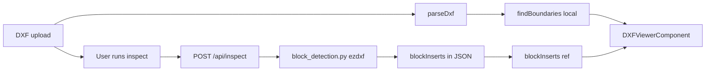

# DXF block INSERT detection and viewer markers

**Status:** Planned  
**Goal:** Detect block INSERT positions with ezdxf on the backend, return them from `/api/inspect`, and show markers in the frontend viewer after inspection.

## Short answer

**Yes — ezdxf is well suited for this.** An `INSERT` in modelspace exposes:

- Insert point: `entity.dxf.insert` (x, y, z)
- Block name: `entity.dxf.name`
- Layer, rotation, scale
- Array grids: `entity.dxf.col_count`, `entity.dxf.row_count`, spacings

The project already uses ezdxf in `main.py` and `boundary_detection.py`, but **nothing reads `INSERT` entities today**. Boundary join logic only considers curve types (`LINE`, `LWPOLYLINE`, etc.).

On the frontend, **dxf-vuer already parses and renders INSERT block geometry** in the viewer. Block **positions** for markers come from the backend inspect response — not from a local JS parser.



## Current gap

| Layer | INSERT geometry drawn? | INSERT position detected? |
|-------|------------------------|---------------------------|
| dxf-vuer viewer | yes | no |
| `findBoundaries` | n/a (curves only) | no |
| `dxf_inspector` / export | n/a | no |

If a client file uses block references for drill symbols or similar, they will **appear in the viewer** but are **invisible to part/drill logic** until we add explicit INSERT handling.

## Scope (v1)

- **Which INSERTs:** All INSERT entities in modelspace (any layer/block name). Optional `layer` / `name_prefix` filters on the Python function for later use.
- **Detection:** Backend only via ezdxf (`block_detection.py`).
- **Delivery:** `/api/inspect` response gains a `blockInserts` array (alongside existing `metadataOverrides`).
- **Display:** Frontend stores `blockInserts` from inspect response and overlays markers in the viewer.
- **Timing:** Markers appear **after inspect completes**, not on initial upload. If the user skips inspect, no markers (acceptable for v1).

## Proposed implementation

### 1. New module: `simple-parts-back/block_detection.py`

Mirror the style of `boundary_detection.py`:

```python
def find_block_inserts(doc, layer=None, name_prefix=None):
    """Return list of INSERT instance records from modelspace."""
```

**Algorithm (ezdxf):**

1. Iterate `doc.modelspace().query("INSERT")`.
2. Skip system/anonymous blocks: names starting with `*` (e.g. `*Model_Space`, `*U`).
3. Apply optional `layer` / `name_prefix` filters.
4. For each INSERT, emit one or more records:
   - **Single instance:** use `entity.dxf.insert`
   - **Array instance:** expand grid — base `(insert.x, insert.y)` + `(col * col_spacing, row * row_spacing)` for `col_count` × `row_count` (defaults 1). Use `entity.dxf.col_count`, `entity.dxf.row_count`, `entity.dxf.col_spacing`, `entity.dxf.row_spacing`.
5. Return normalized dicts:

```python
{
    "id": f"{handle}:{row}:{col}",
    "handle": str(entity.dxf.handle),
    "name": entity.dxf.name,
    "layer": entity.dxf.layer or "0",
    "x": float,
    "y": float,
    "rotation": float,
    "xScale": float,
    "yScale": float,
}
```

**Deferred (not in v1):** nested INSERT positions inside block definitions, MINSERT entity type, bbox-center instead of insert point, associating blocks to part boundaries (point-in-polygon).

### 2. Wire into inspect: `simple-parts-back/dxf_inspector.py`

In `inspect()` (already loads the doc via `_load_dxf`):

```python
from block_detection import find_block_inserts

# ... existing logic ...

return {
    "metadataOverrides": overrides,
    "blockInserts": find_block_inserts(doc),
}
```

No change needed to `app.py` — `/api/inspect` already returns the inspect dict as JSON.

### 3. Frontend: consume inspect response — `simple-parts-front/src/App.vue`

- Add `blockInserts` ref (default `[]`).
- Reset `blockInserts` on new file upload (same place boundaries are reset).
- In `runInspect()`, after a successful response:

```js
blockInserts.value = data.blockInserts ?? []
```

- Optionally mention block count in the post-inspect assistant message when `blockInserts.length > 0`.
- Pass `blockInserts` into `DXFViewerComponent` as a prop.

**No `blockDetection.js`** — detection is server-authoritative via ezdxf.

### 4. Viewer overlay: `simple-parts-front/src/components/DXFViewerComponent.vue`

Reuse the existing **world → screen** projection pattern from `screenLabels` / `PartTagBubble`:

- Add computed `blockMarkers` from `props.blockInserts`, projecting `(x, y)` with `viewer2dCamera` + `viewer2dOriginOffset` (same as part tags at lines ~280–307)
- Render markers in a new small overlay component (e.g. `BlockMarkerOverlay.vue`) or inline divs:
  - **Symbol:** small cross or diamond (CSS, not DXF geometry) — visually distinct from round part-number bubbles
  - **Label (optional v1):** block name truncated, or omit text and rely on shape/color
  - `pointer-events: none`, `z-index` above canvas, updates on pan/zoom via existing `cameraTick`

**Visibility:** show markers when `blockInserts.length > 0` in input view mode.

### 5. Tests: `simple-parts-back/tests/test_block_detection.py`

Follow the pattern in `test_boundary_detection.py`:

- Build DXF fixtures with ezdxf: one single INSERT, one 2×2 array INSERT
- Assert record count, coordinates, and that `inspect()` includes `blockInserts` in its return value

No sample INSERT DXFs exist in the repo today; tests use programmatic ezdxf fixtures.

## Edge cases to document (not v1)

- **Empty/missing block definition:** INSERT with unknown `name` — still emit insert point; viewer may draw nothing
- **Entities only inside block defs, no INSERT in modelspace:** not detected (would need recursive block walk)
- **User skips inspect:** no markers until a future lightweight endpoint or upload-time call is added
- **Drill workflow:** `dxf_inspector.py` currently treats drill layer as closed **curve** boundaries; INSERT drill symbols would need separate association logic later (point-in-part-boundary)

## Files touched

| File | Change |
|------|--------|
| `simple-parts-back/block_detection.py` | **new** — ezdxf INSERT detection |
| `simple-parts-back/dxf_inspector.py` | call `find_block_inserts`, add to return dict |
| `simple-parts-back/tests/test_block_detection.py` | **new** — unit + inspect integration tests |
| `simple-parts-front/src/App.vue` | `blockInserts` ref, read from inspect response, pass to viewer |
| `simple-parts-front/src/components/DXFViewerComponent.vue` | prop + screen projection + overlay |
| `simple-parts-front/src/components/BlockMarkerOverlay.vue` | **new** — marker UI (optional; can be inline) |

## Tasks

- [ ] Create `block_detection.py` with `find_block_inserts(doc, ...)` — ezdxf, single + array INSERT expansion, skip `*` blocks
- [ ] Return `blockInserts` from `dxf_inspector.inspect()`
- [ ] Store `blockInserts` in `App.vue` from `/api/inspect` response; reset on new file; pass to viewer
- [ ] Add block marker overlay in `DXFViewerComponent` using world→screen projection (`PartTagBubble` pattern)
- [ ] Add `test_block_detection.py` with ezdxf fixtures and inspect integration check
