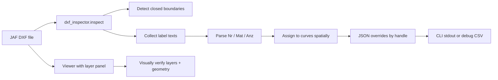

# DXF inspection — narrowed v1 (backend + layer panel)

## Scope (what we're building now)

| In scope | Out of scope (defer) |
|----------|----------------------|
| [`dxf_inspector.py`](../dxf_inspector.py) — JAF metadata injection logic | Chat `askInspect` routing in [`App.vue`](../../simple-parts-front/src/App.vue) |
| Curve detection (which entities count as parts) | `POST /api/inspect` endpoint |
| Text parsing (which MTEXT/TEXT becomes Nr, Mat, Anz) | Frontend inspect call / overrides merge |
| Spatial assignment (text → nearest/inside curve) | Per-entity layer row on metadata panel |
| CLI to run inspector against `input/JAF/` samples | Multi-company config UI |
| Layer panel toggle in viewer | DXF rewrite / XData embedding |

**Rationale:** Perfect the rules on real JAF files first via CLI + layer panel for visual debugging. Wire to the app later.



---

## 1. Layer panel (viewer only)

Minimal frontend change — enough to debug which layers carry geometry vs. labels.

- Add `showLayerPanel` ref in [`App.vue`](../../simple-parts-front/src/App.vue); reset on attach/clear like other viewer toggles.
- Pass to [`DXFViewerComponent.vue`](../../simple-parts-front/src/components/DXFViewerComponent.vue).
- Change `:show-layer-panel="false"` → `:show-layer-panel="showLayerPanel"`.
- Add `LayerPanelToggle.vue` in `.viewer-toggles` (copy pattern from [`PartPropertiesToggle.vue`](../../simple-parts-front/src/components/PartPropertiesToggle.vue)).

`dxf-vuer` provides the full layer table (visibility toggles, colors, hover highlight). No custom layer popup needed.

---

## 2. `dxf_inspector.py` — core logic

### Public API

```python
def inspect(path: str, profile: str = "jaf") -> dict:
    """
    Returns {
        "metadataOverrides": { handle: { "nr", "mat", "anz" } },
        "curves": [{ "handle", "layer", "nr", "mat", "anz" }],  # all detected boundaries
        "debug": [{ "text", "layer", "parsed", "assigned_handle", "method" }],
    }
    """
```

Profile dispatch: only `"jaf"` for now; structure leaves room for more later.

### 2a. Curve detection

Reuse the same definition as [`main.py`](../main.py) and the frontend:

- **Include:** `CIRCLE`, `ELLIPSE`, closed `LWPOLYLINE` / `POLYLINE` / `POLYLINE3D`
- **Exclude:** open polylines, construction geometry on `Defpoints`, etc.

Extract per curve: `handle`, `layer`, centroid/bbox (for assignment), optional area.

Refactor option: extract `_entity_is_closed_boundary()` from `main.py` into a shared module if import-from-main is awkward; otherwise duplicate minimally in inspector for now.

### 2b. JAF text candidates

Scan model space for `TEXT`, `MTEXT`, `ATTRIB`. For each:

- Strip MTEXT formatting (`{\fArial;...}`, `\P` newlines, `\L` etc.) to plain text
- Record: `handle`, `layer`, insertion point, raw + cleaned text

**Observed JAF patterns** (from [`input/JAF/`](../input/JAF/)):

| Pattern | Example | Maps to |
|---------|---------|---------|
| Combined block | `1_Stk. Handlauf EG` + `Material: Nirorohr Ø42,4x2mm...` | Anz + Nr + Mat |
| Quantity line | `1 Stk.`, `31 Stk.` | Anz |
| Material line | `Material: ...` | Mat |
| Dimension-only | `Ø8.5`, `24` on `FERTIGUNG 02 Bemassung *` layers | **Ignore** (not part metadata) |

Layer-based filtering helps: prefer text on non-dimension layers; skip `*Bemassung*`, `Defpoints`, etc. Tune list while testing.

### 2c. Parsing rules (`parse_jaf_text`)

Start from proximity script helpers in [`-aux/clientInputTransform_proximity.py`](../-aux/clientInputTransform_proximity.py) (`classify_text`, `parse_field`, `parse_part_info`) and extend for JAF:

- `Nr` ← descriptive name after quantity prefix (e.g. `Handlauf EG` from `1_Stk. Handlauf EG`)
- `Anz` ← leading integer from `N Stk.` / `N_Stk.`
- `Mat` ← value after `Material:`

When one MTEXT block contains both lines (`\P`-separated), parse as a single group.

### 2d. Spatial assignment

Port from proximity script:

1. **Group** related Nr/Anz/Mat texts (combined MTEXT, or greedy nearest NR→ANZ/MAT pairing)
2. **Assign group → curve:** point inside closed curve first; else nearest curve by distance to centroid
3. One-to-one: each curve gets at most one label group

Output `metadataOverrides` keyed by curve handle (string).

### 2e. CLI for development

```bash
pipenv run python dxf_inspector.py "input/JAF/Lewog Geländer Maxplatten 02.dxf"
```

- Print summary: N curves found, M assigned, K unassigned
- Print JSON to stdout (or write `inspection_debug.csv` alongside)
- Optional `--csv` flag for assignment debug table (text handle, curve handle, method, parsed nr/mat/anz)

This is the primary test loop until API/chat integration.

---

## 3. Implementation order

1. **Layer panel toggle** — quick win for visual debugging while tuning rules
2. **Inspector skeleton** — read DXF, list curves + texts (no assignment yet)
3. **JAF text parsing** — handle combined MTEXT blocks and `Material:` lines
4. **Spatial assignment** — port proximity matching
5. **CLI + iterate** on both JAF sample files until assignments look correct

---

## 4. Manual test plan

**Viewer**

- Upload any DXF → toggle layer panel → layers list appears, hide/show works

**Inspector CLI**

```bash
cd simple-parts-back
pipenv run python dxf_inspector.py "input/JAF/Lewog Geländer Maxplatten 02.dxf"
```

- Reports closed curves on expected geometry layers (not dimension-only layers)
- Parses `1_Stk. Handlauf EG` / `Material: ...` blocks into nr/mat/anz
- Ignores pure dimension MTEXT (`Ø8.5`, `24`)
- Assignment debug shows sensible text→curve pairings

**Cross-check:** Open same file in viewer with layer panel; verify label layers vs. geometry layers match inspector debug output.

---

## 5. Deferred (next phase after rules are solid)

- `POST /api/inspect` in [`app.py`](../app.py)
- Chat gate when no embedded metadata
- Merge overrides into frontend state before export
- Read-only layer field on click-for-properties panel
