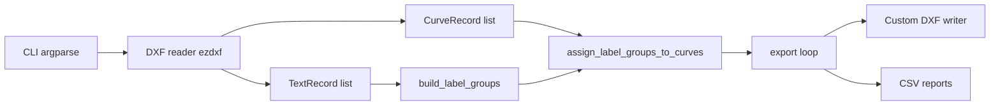

# Standalone DXF CNC Export

**Status:** Approved  
**Goal:** Convert `clientInputTransform.py` from a Rhino-embedded script into a standalone Python 3 CLI.

```bash
python clientInputTransform.py ClientInputExample.dxf -o ./output
```

No Rhino, `rhinoscriptsyntax`, or document mutation required.

## What changes vs today

| Rhino-only (current) | Standalone (target) |
|---|---|
| Reads `sc.doc.Objects` | Reads source DXF via `ezdxf` |
| `rs.BrowseForFolder()` | `--output` CLI flag |
| Creates/deletes temp blue layers in Rhino | Removed entirely |
| `Rhino.Geometry` for area/containment/export | Lightweight 2D geometry helpers + stored DXF primitives |
| IronPython-compatible patterns | Python 3.10+ |

**Unchanged logic:** text parsing (`Nr.` / `Anz.` / `Mat.`), greedy NR→ANZ/MAT grouping, curve assignment priority (inside → nearest), material filter (`3-Schicht`), quantity-based filenames (`4008_1.dxf` …), dual-layer export, four CSV reports, custom AC1015 DXF writer.

## Input format (confirmed from example file)

`ClientInputExample.dxf` contains:

- **Closed curves:** `POLYLINE` (2D) on layer `CURVES`, flag bit 1 = closed
- **Labels:** `MTEXT` entities on layer `TEXT` with plain text like `Nr.: 4009`, `Anz.: 2`, `Mat.: 3-Schicht`
- Insert point: MTEXT group codes 10/20/30

The reader will also accept `TEXT` entities and `LWPOLYLINE` closed curves for robustness.

## Architecture



## File structure (2 files + requirements)

No package folder. Project root: `G:\Shared drives\CEB\Projects\SimpleParts\test\rhino-independent-code\`

| File | Role |
|---|---|
| `clientInputTransform.py` | **Orchestrator** — CLI, settings, geometry helpers, label parsing/grouping/assignment, ezdxf reader, export pipeline, CSV writes |
| `dxf_writer.py` | **DXF output only** — custom AC1015 writer, adapted to `Point3d` + primitive dispatch (**no Rhino, no ezdxf**) |
| `requirements.txt` | `ezdxf>=1.3` |

`clientInputTransform.py` sections:

```
# SETTINGS
# GEOMETRY HELPERS          (Point3d, polygon area, point-in-polygon, distance)
# TEXT PARSING              (classify, parse_field, build_label_groups, assign)
# DXF READER                (ezdxf → CurveRecord / TextRecord)
# CSV
# EXPORT PIPELINE + CLI     (main, argparse)
```

## Key implementation details

### 1. DXF reader (section in orchestrator)

Use `ezdxf.readfile()` (fall back to `ezdxf.recover.readfile()` if needed).

**Curves** — collect closed boundary entities, skip export layers (`OUTSIDE_MASS_T201_Z10`, `OUTSIDE_MASS_FINAL_T202_ZM02`):

- `LWPOLYLINE` with closed flag
- `POLYLINE` / `POLYLINE3D` with closed flag
- `CIRCLE` (always closed)

```python
@dataclass
class CurveRecord:
    id: str              # DXF handle
    layer: str
    boundary_xy: list    # [(x,y), ...] for spatial queries
    export_primitives: list  # ("LINE", p0, p1) | ("ARC", ...) | ("LWPOLYLINE", pts, closed, z)
```

Flatten arcs/splines at read time only when needed for spatial queries (`ezdxf.path`, tolerance ~0.01). For export, prefer native primitives.

**Texts** — collect `TEXT` and `MTEXT`:

```python
@dataclass
class TextRecord:
    id: str
    text: str            # MTEXT: entity.plain_text()
    point: Point3d       # insert point
```

### 2. Geometry helpers (section in orchestrator)

Pure-Python 2D algorithms (no `shapely`):

- **Area:** shoelace formula
- **Inside test:** ray-casting point-in-polygon
- **Nearest distance:** min distance to boundary segments
- **Center:** bounding-box center

Assignment sort key: `(inside_priority, area_score, distance)`.

### 3. DXF writer (`dxf_writer.py`)

Port lines 480–1016 from the current file:

- Replace `rg.Point3d` with `Point3d` dataclass
- Replace `dxf_export_curve` with `dxf_write_primitives` dispatching stored primitives
- Remove Rhino tessellation — input is already DXF-native
- CLI `--tolerance` (default `0.01`) only for flattening splines at read time

### 4. Pipeline (section in orchestrator)

1. Load curves + texts from input DXF
2. `build_label_groups` / `assign_label_groups_to_curves`
3. For each curve with matching material: export `name_1.dxf` … `name_N.dxf` (same curve on both CNC layers)
4. Write four CSVs to output folder
5. Print summary to stdout

**Removed:** temp Rhino layers, curve copies, `BrowseForFolder`, `KEEP_TEMP_LAYERS_FOR_DEBUG`.

### 5. CLI

```
python clientInputTransform.py INPUT.dxf -o OUTPUT_DIR [--material 3-Schicht] [--tolerance 0.01]
```

## Validation plan

Run against `ClientInputExample.dxf`:

1. Script completes without errors
2. DXF count matches sum of `Anz.` for all `3-Schicht` parts
3. Spot-check one output DXF: valid AC1015, two blue layers, closed curve geometry
4. CSVs have expected columns and semicolon delimiter
5. `assignment_warnings.csv` flags curves missing NR/ANZ/MAT

## Risks / known differences

- **Spline-heavy curves:** flattened at read time; example file uses polylines only
- **MTEXT formatting:** `plain_text()` strips formatting; label regex unchanged
- **Large files:** `ezdxf.recover` fallback may be slower

## Implementation todos

- [ ] Extract custom DXF writer into `dxf_writer.py` (~520 lines, Point3d + primitive dispatch)
- [ ] Rewrite `clientInputTransform.py` as orchestrator (settings, geometry, labels, ezdxf reader, pipeline, CLI)
- [ ] Run against `ClientInputExample.dxf` and verify DXF/CSV output
